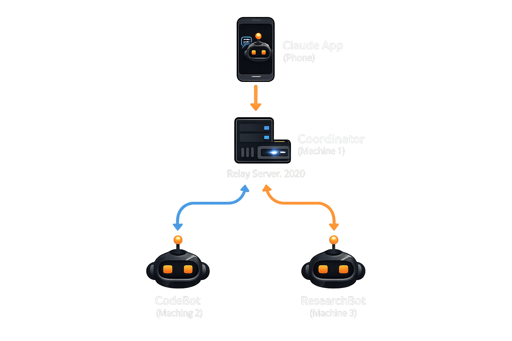
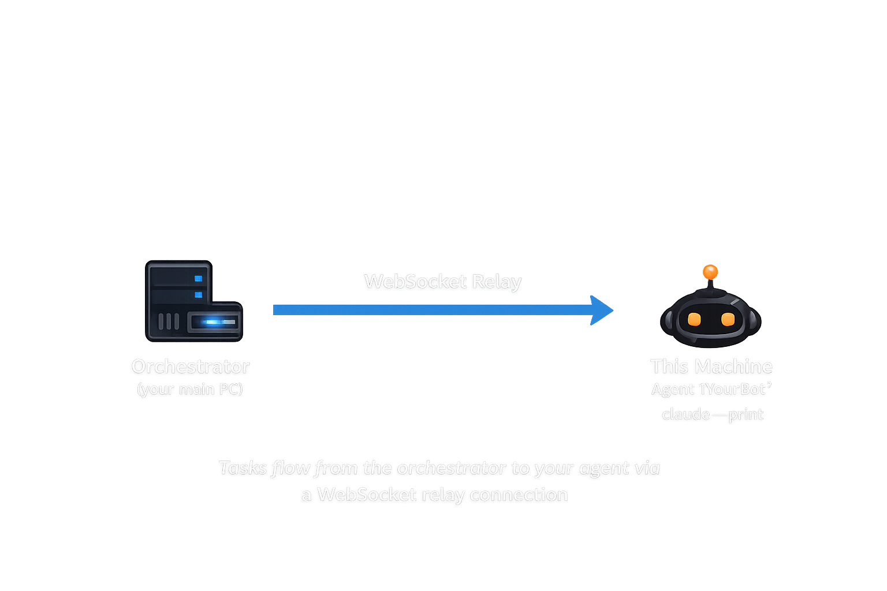
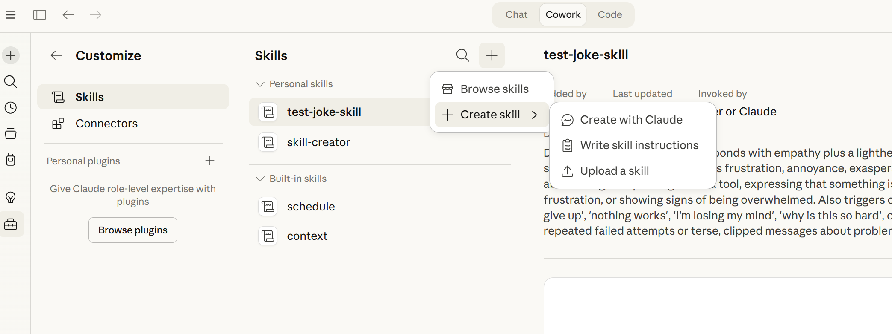
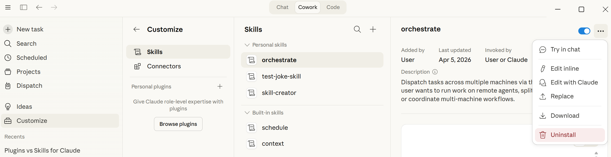

# Multi-Machine Claude Dispatch Orchestrator

> **Platform: Windows only.** This project is built and tested exclusively on Windows (10/11). Service installation uses NSSM and PowerShell, sleep prevention uses the Win32 `SetThreadExecutionState` API, and paths assume Windows conventions. It has **not been tested** on macOS or Linux. Contributions to add cross-platform support are welcome.

Extends Anthropic's [Dispatch](https://docs.anthropic.com/en/docs/claude-code/dispatch) (phone to one desktop) into a hub-and-spoke model: your phone dispatches tasks through an orchestrator machine, which routes subtasks to one or more named worker agents over a local WebSocket relay.



Each agent machine runs a lightweight worker that connects to the orchestrator's relay:



## What This Enables (Beyond Standard Dispatch)

Standard Dispatch pairs your phone to **one** desktop. This orchestrator removes that limitation and opens up scenarios that aren't possible otherwise:

### Parallel multi-machine work
> *"Hey Claude, run the full test suite on my dev machine AND do a security audit of the auth module on my workstation — give me a combined report."*

Both tasks run simultaneously on different machines. You get one aggregated answer on your phone.

### Named specialist agents
> *"Ask CodeBot to refactor the payment service to use Stripe v3, and have ResearchBot find the top 5 competitor pricing pages."*

Each machine has a personality and capabilities. Route work to the right agent by name, like delegating to team members.

### Remote fleet orchestration from your phone
> *"Deploy the staging build on machine-3, then run smoke tests on machine-4 against the staging URL."*

Trigger multi-step workflows across your home lab, office machines, or cloud VMs — all from your phone while you're away from your desk.

### Unattended overnight batch processing
> *"Process all 200 PDF invoices in D:/invoices — split them across all available machines and extract line items into a spreadsheet."*

With sleep prevention enabled, machines stay awake and grind through large batch jobs overnight. Task queue ensures nothing is dropped even if all machines are temporarily busy.

### Capability-based auto-routing
> *"Analyze this codebase for performance bottlenecks."*

You don't even need to pick a machine. The coordinator matches keywords in your request against agent capabilities and load-balances across idle workers automatically.

### Live monitoring dashboard
> *Open `http://coordinator:7070/dashboard` from any device on your network.*

See which agents are connected, what they're working on, task history, queue depth, and performance stats — all in real time.

## Prerequisites

| Dependency | Required | How to install |
|-----------|----------|----------------|
| **Node.js 18+** | Yes (all machines) | `winget install OpenJS.NodeJS.LTS` or [nodejs.org](https://nodejs.org/) |
| **Claude Code CLI** | Yes (worker machines) | `npm install -g @anthropic-ai/claude-code` |
| **Inno Setup 6** | For building .exe installers | `winget install JRSoftware.InnoSetup` or [jrsoftware.org](https://jrsoftware.org/isdl.php) |
| **NSSM** | For running as Windows services | `winget install NSSM.NSSM` or [nssm.cc](https://nssm.cc/) |
| **OpenSSL** | For TLS certificates | Ships with [Git for Windows](https://gitforwindows.org/) |

## Quick Start

### 1. Install dependencies

```bash
npm install
```

### 2. Configure the shared secret

Generate a strong secret and set it in both config files (must match):

```bash
# Generate a random secret
node -e "console.log(require('crypto').randomBytes(32).toString('hex'))"
```

Edit `relay/config.json` and `worker/worker-config.json` — replace `"CHANGE-ME-generate-a-real-secret"` with your generated secret.

### 3. Set the PIN

Edit `relay/config.json` — change `pin.code` from `"1234"` to your chosen PIN. This is a second factor required for task submission.

### 4. Start the relay (Machine 1)

```bash
npm run relay
```

You should see:

```
[relay] Task registry initialized
[relay] Ready — listening on 0.0.0.0:7070
[relay] Discovery broadcasting is active
```

### 5. Start a worker (Machine 2+)

Edit `worker/worker-config.json`:
- Set `machineId` to a unique ID (e.g., `"machine-2"`)
- Set `agentName` to a friendly name (e.g., `"CodeBot"`)
- Set `coordinatorHost` to the relay address (e.g., `"ws://192.168.1.100:7070"`) or `"auto"` for discovery
- Set `defaultWorkingDir` to the folder the agent should operate in
- Add allowed directories to `allowedDirs`

```bash
npm run worker
```

### 6. Open the dashboard

Navigate to `http://localhost:7070/dashboard` in your browser. Enter your shared secret (Bearer token) in settings.

### Running multiple agents on one machine

You can run multiple agents on the same machine with different configs. Each agent needs a unique `machineId` and `agentName`:

```bash
# Copy the default config
cp worker/worker-config.json worker/config-codebot.json
cp worker/worker-config.json worker/config-researcher.json

# Edit each config — set different machineId, agentName, agentCapabilities, defaultWorkingDir

# Run each agent with its own config
node worker/agent-relay.js --config worker/config-codebot.json
node worker/agent-relay.js --config worker/config-researcher.json
```

Each agent registers independently with the relay and appears as a separate worker in the dashboard. This is useful for testing or running specialized agents with different capabilities and working directories on the same machine.

## Architecture

### File Structure

```
relay/
├── server.js          # WebSocket relay + HTTP API + dashboard serving
├── registry.js        # SQLite task state (sql.js, pure WASM)
├── config.json        # Relay configuration (all features)
├── audit.js           # Structured JSONL audit logging
├── discovery.js       # UDP broadcast for auto-discovery
└── queue.js           # Task queue for busy machines

worker/
├── agent-relay.js     # WS client + claude subprocess runner
├── worker-config.json # Agent identity, security, and connection config
└── discovery.js       # UDP listener for relay auto-discovery

coordinator/
├── decompose.js       # Task decomposition + orchestration
└── load-balancer.js   # Multi-strategy load balancing

dashboard/
└── index.html         # Single-page monitoring UI (no build tools)

lib/
└── keep-awake.js      # Windows sleep prevention (shared)

install/
├── install-relay.ps1  # Register relay as Windows service (NSSM)
├── install-worker.ps1 # Register worker as Windows service (NSSM)
├── generate-certs.ps1 # Generate TLS certificates (OpenSSL)
├── setup-wizard.ps1   # Orchestrator setup wizard (WinForms GUI)
└── inno/              # Inno Setup installer build system
    ├── build.ps1              # Build .exe installers
    ├── dispatch-orchestrator.iss  # Orchestrator installer script
    ├── dispatch-agent.iss         # Agent installer script
    └── assets/                    # Wizard banners, icons

docs/
└── images/            # Architecture diagrams for README and wizards
```

### Communication Flow

1. **Phone** sends a task via Claude Dispatch to the orchestrator
2. **Orchestrator** decomposes the task, calls `POST /task` on the relay for each subtask
3. **Relay** routes each subtask to the target worker via WebSocket
4. **Worker** spawns `claude --print --permission-mode auto "<prompt>"` scoped to allowed directories
5. **Worker** sends the result back through the relay
6. **Coordinator** aggregates all results and replies to the phone

### Protocol

All messages are JSON over WebSocket:

| Direction | Type | Purpose |
|-----------|------|---------|
| Worker to Relay | `register` | Authenticate and announce agent identity |
| Relay to Worker | `task` | Dispatch a task with prompt and workingDir |
| Worker to Relay | `result` | Return task output, status, and duration |
| Relay to Worker | `ping` | Heartbeat check |
| Worker to Relay | `pong` | Heartbeat response with current status |

### HTTP API

All API endpoints require `Authorization: Bearer <shared-secret>` header.

| Method | Endpoint | Description |
|--------|----------|-------------|
| `GET` | `/status` | Connected machines, agents, and their states |
| `GET` | `/task/:id` | Get a specific task by ID |
| `GET` | `/tasks` | List tasks (filter: `?status=`, `?machineId=`, `?limit=`, `?offset=`) |
| `GET` | `/stats` | Per-machine performance statistics |
| `GET` | `/queue` | Current task queue status |
| `GET` | `/audit` | Audit log entries (filter: `?event=`, `?level=`, `?limit=`) |
| `POST` | `/task` | Submit a task (requires PIN) |
| `GET` | `/dashboard` | Web UI |

#### POST /task body

```json
{
  "agentName": "CodeBot",
  "prompt": "Refactor the auth module to use JWT",
  "workingDir": "C:/projects/my-app",
  "pin": "1234"
}
```

You can target by `agentName` (friendly name, case-insensitive) or `machineId`. Use `"machineId": "any"` to let the load balancer choose. If the target is busy, the task is queued and a `202 Accepted` response is returned.

## Named Agents

Workers register with a human-friendly name and capabilities:

```json
{
  "agentName": "CodeBot",
  "agentDescription": "Handles coding tasks, refactoring, and code review",
  "agentCapabilities": ["code", "refactor", "review", "debug"]
}
```

From your phone, you can say things like:
- *"Send this to CodeBot"*
- *"Have ResearchBot look into this"*
- *"Ask CodeBot to refactor the auth module"*

The coordinator automatically matches task keywords to agent capabilities when deciding where to route subtasks.

## Orchestrate Skill (Claude Code Custom Command)

The project includes a custom Claude Code command at `.claude/commands/orchestrate.md` that teaches Claude the full orchestration protocol. When invoked via `/orchestrate`, Claude knows how to:

1. Check `/status` for available agents
2. Decompose tasks and match them to agent capabilities
3. Submit subtasks via `POST /task` with PIN authentication
4. Poll `/task/:id` every 10 seconds until completion
5. Retry failed subtasks on different agents (once)
6. Aggregate results into a single response (under 300 words for phone/Dispatch)

This is what makes the Dispatch integration work — without it, Claude on the coordinator machine wouldn't know the relay exists or how to use it.

### Claude Code (CLI)

The setup wizard deploys the skill to `~/.claude/skills/orchestrate/SKILL.md` with your shared secret and PIN baked in. Use `/orchestrate` in any Claude Code session.

### Claude Cowork / Dispatch

Cowork runs skills inside isolated cloud containers and does not read from the host's `~/.claude/skills/` directory. The setup wizard packages the skill as a `.skill` file (zip archive) with your credentials baked in.

> **Important:** The relay runs on `localhost`, so the skill requires local machine access. When invoked from Cowork (including via Dispatch), Claude will automatically request a local code session and ask to trust the orchestrator's installed directory. Once approved, commands run on your machine where the relay is reachable. This approval is a one-time step per directory.

**To install:**

1. After the setup wizard completes, click **"Open Cowork Skill"** to locate the `orchestrate.skill` file
2. In Claude Cowork, go to **Customize → Skills → + Create skill → Upload a skill**

<p align="center">
  
</p>

3. Drag or select the `orchestrate.skill` file in the upload dialog

<p align="center">
  
</p>

Once installed, the skill appears under **Personal skills** and can be managed (updated, downloaded, or uninstalled) from the skill detail view:

<p align="center">
  
</p>

**Fallback (if packaging fails):** Click **"Copy Cowork Prompt"** on the Complete page, open Cowork, type `/skill-creator`, and paste the prompt to create the skill interactively.

## Security

### Multi-Layer Authentication

| Layer | Protects | Mechanism |
|-------|----------|-----------|
| **Shared Secret** | WebSocket connections | Token sent on `register`, wrong token = immediate disconnect |
| **Bearer Token** | HTTP API | `Authorization: Bearer` header on all API endpoints |
| **PIN Code** | Task submission | Second factor on `POST /task` with per-IP lockout (5 attempts, 15 min) |

### Path Safety

- **Allowlist**: Workers only execute in directories listed in `allowedDirs`
- **Denylist**: System directories (`C:/Windows`, `C:/Program Files`, etc.) are blocked
- **Path traversal protection**: `..` segments, UNC paths, and null bytes are rejected at both relay and worker levels
- **Directory validation**: Worker verifies the directory exists before spawning

### Input Limits

| Limit | Default | Config Key |
|-------|---------|------------|
| Prompt length | 50,000 chars | `limits.maxPromptLength` |
| Output length | 1,000,000 chars | `limits.maxOutputLength` |
| Request body | 100 KB | `limits.maxRequestBodyBytes` |
| Tasks per minute | 10 | `rateLimiting.maxTasksPerMinute` |
| Tasks per hour | 100 | `rateLimiting.maxTasksPerHour` |

### Audit Logging

All security events are logged to `data/audit.log` (JSONL format):
- Task submissions and completions
- Worker connections and disconnections
- Authentication failures
- PIN failures and lockouts
- Path validation denials
- Rate limit hits

View recent logs: `GET /audit?level=error&limit=50`

### Agent Sandboxing

Agents run with multiple layers of restriction:

| Layer | What it does |
|-------|-------------|
| **Directory restrictions** | `allowedDirs`/`denyDirs` in config — validated at task submission and enforced via prompt rules |
| **Tool permissions** | `allowedTools`/`disallowedTools` passed to Claude via `--allowedTools`/`--disallowedTools` flags |
| **Permission mode** | `--permission-mode auto` — auto-approves within allowed directories only |
| **Prompt injection detection** | Rejects prompts with known injection patterns before execution |
| **Data privacy rules** | System prompt prohibits returning credentials, PII, or system info |
| **Output audit** | Scans Claude's output for credential patterns and denied path references |
| **Relay-side validation** | Blocks prompts requesting credential files or system reconnaissance |

### TLS Encryption (Optional)

Enable encrypted WebSocket (WSS) and HTTPS:

```powershell
# Generate certificates
.\install\generate-certs.ps1

# Enable in relay/config.json
# Set tls.enabled = true

# Enable in worker/worker-config.json
# Set tls.enabled = true
# Change coordinatorHost from ws:// to wss://
```

## Networking & Connectivity

Workers need to know where the relay is. There are two ways to connect, depending on your network topology.

### Local Network (LAN)

On the same subnet, workers can **auto-discover** the relay with zero configuration:

1. The relay broadcasts a UDP packet to `255.255.255.255:7071` every 5 seconds, announcing its IP and port
2. Workers with `coordinatorHost` set to `"auto"` listen for these broadcasts and connect automatically

```json
// worker/worker-config.json
{
  "coordinatorHost": "auto",
  "discovery": { "enabled": true, "broadcastPort": 7071 }
}
```

UDP broadcast does **not** cross routers or subnets. All machines must be on the same local network segment for discovery to work.

Alternatively, you can skip discovery and point workers directly at the relay's LAN IP:

```json
"coordinatorHost": "ws://192.168.1.100:7070"
```

### Public Internet / Cross-Subnet

For machines on different networks (remote offices, cloud VMs, etc.), auto-discovery won't work. Instead:

1. **Set `coordinatorHost`** to the relay's public address or hostname:
   ```json
   "coordinatorHost": "wss://relay.example.com:7070"
   ```

2. **Enable TLS** — strongly recommended for any non-local traffic. Enable in both `relay/config.json` and `worker/worker-config.json`:
   ```json
   "tls": { "enabled": true, "certFile": "...", "keyFile": "...", "caFile": "..." }
   ```
   Generate certificates with `.\install\generate-certs.ps1`. The relay uses mutual TLS (mTLS) — both sides verify each other's certificates.

3. **Open the relay port** (default 7070) on the coordinator's firewall/router. The relay binds to `0.0.0.0`, so it accepts connections from any interface.

4. **Authentication is always enforced** regardless of network type — workers must present the `sharedSecret` token on registration, and all HTTP API calls require a Bearer token.

### Connection Resilience

Workers automatically reconnect if the relay goes down or the network drops. Reconnection uses exponential backoff starting at 1 second, capped at 30 seconds. Once the relay is reachable again, the worker re-registers and is immediately available for tasks.

### Summary

| Scenario | Discovery | `coordinatorHost` | TLS |
|----------|-----------|-------------------|-----|
| Same machine (dev/testing) | Optional | `ws://localhost:7070` | Not needed |
| Same LAN subnet | Auto | `"auto"` | Optional |
| Cross-subnet / VPN | No | `ws://<relay-ip>:7070` | Recommended |
| Public internet | No | `wss://<relay-host>:7070` | **Required** |

## Features

### Task Queue

When all workers are busy, tasks are queued instead of rejected. The queue drains automatically as workers become idle. Configure with `queue.maxQueueSize` (default: 100).

### Load Balancing

Four strategies for distributing tasks across workers:

| Strategy | Description |
|----------|-------------|
| `round-robin` | Rotate through idle workers in order |
| `least-busy` | Pick the worker with fewest recent tasks (default) |
| `fastest` | Pick the worker with lowest average task duration |
| `random` | Random selection from idle workers |

Set in `relay/config.json` under `loadBalancing.strategy`.

### Auto-Discovery

Workers can find the relay automatically on the local network via UDP broadcast. Set `coordinatorHost` to `"auto"` in worker config. Discovery skips virtual adapter IPs (WSL, Hyper-V, VMware, Docker, VirtualBox) and virtual IP prefixes (172.16-31.x, 169.254.x link-local) to ensure the broadcast announces a reachable physical/Wi-Fi address. See [Networking & Connectivity](#networking--connectivity) for details on LAN vs public internet setups.

### Heartbeat Monitoring

The relay pings all workers every 30 seconds. Workers that don't respond within 10 seconds are disconnected and their running tasks are marked as errors. Configure intervals in `relay/config.json` under `heartbeat`.

### Sleep Prevention

Both the relay and workers prevent Windows from sleeping while active. Uses the Windows `SetThreadExecutionState` API. Disable with `keepAwake.enabled: false` in config.

### Task Retention

Completed tasks (`done`, `error`, `timeout`) are automatically purged after 7 days. The purge runs on relay startup and every 24 hours. Pending and running tasks are never purged regardless of age.

### Browser Automation (Playwright MCP)

The agent setup wizard offers an optional **Playwright MCP** installation. When enabled, the agent gets a real Chromium browser it can use to navigate web pages, click buttons, fill forms, and take screenshots. The wizard:

1. Downloads Chromium via `npx playwright install chromium`
2. Configures `@playwright/mcp` in the user's `~/.claude.json`

This is useful for agents that need to interact with web applications (e.g., opening Google Meet, submitting forms, taking screenshots of dashboards).

### Dashboard

A real-time web dashboard at `http://localhost:7070/dashboard` showing:
- Connected agents with status, capabilities, and health
- Agent count displayed in the Submit Task section
- Task history with filtering and pagination
- Task submission form with agent targeting
- Queue status indicator
- Auto-refresh (5 second interval, toggleable)

All API calls from the dashboard are gated behind the auth token — no unauthenticated requests are made on page load.

## Building Installers

Standalone `.exe` installers for distributing to machines. Requires **Inno Setup 6**.

### Install Inno Setup (one-time)

```powershell
winget install JRSoftware.InnoSetup
```

Or download manually from [jrsoftware.org/isdl.php](https://jrsoftware.org/isdl.php). After installing, **restart your terminal** so `ISCC.exe` is on PATH.

### Build the installers

```bash
# Step 1: Generate banner images and icons from dedicated logo files in logo/
npm run build:assets

# Step 2: Build both installers
npm run build:all-installers
```

Or build individually:

```bash
npm run version:sync             # Sync version from package.json to installers
npm run build:installer          # Orchestrator:    dist/DispatchOrchestratorSetup.exe
npm run build:agent-installer    # Agent-only:       dist/DispatchAgentSetup.exe
```

Output goes to `dist/` with SHA256 checksums.

| Installer | Target Machine | What's included |
|-----------|---------------|-----------------|
| `DispatchOrchestratorSetup.exe` | Orchestrator (Machine 1) | Relay, dashboard, orchestrator setup wizard |
| `DispatchAgentSetup.exe` | Workers (Machine 2+) | Agent relay, discovery, keep-awake, agent setup wizard |

The **orchestrator installer** has three Start Menu shortcuts: **Dashboard**, **Start Relay**, and **Setup**. The finish page offers two checkboxes: "Launch Setup Wizard" (checked by default) and "Start Relay and open Dashboard" (unchecked by default). The agent installer is separate, intended for worker machines only.

Both installers offer **Basic** and **Advanced** setup modes:
- **Basic** (default): Quick setup with just the essentials (port, secret, agent name)
- **Advanced**: Full control over TLS, services, directories, tool permissions, and all options

Both installers:
- Check for Node.js and Claude Code CLI prerequisites
- Run `npm install` automatically
- Launch the setup wizard after installation
- Auto-configure dashboard auth token on first launch
- Create Start Menu shortcuts
- Include an uninstaller that cleans up services
- Write installer logs to `%ProgramData%\DispatchOrchestrator\logs\`

### Setup Wizard (without building an installer)

If you cloned the repo directly instead of using an installer, you can run the setup wizard from source:

```bash
npm run setup                    # Full orchestrator wizard (coordinator or worker)
```

## Windows Service Installation

Run as persistent background services that survive reboots:

```powershell
# On the coordinator (Machine 1)
.\install\install-relay.ps1

# On each worker machine
.\install\install-worker.ps1
```

Requires [NSSM](https://nssm.cc/) on PATH. Logs are written to the `logs/` directory.

## Starting After Reboot / Shutdown

There are three ways to run the orchestrator, depending on your setup:

### Option A: Windows Services (recommended for always-on machines)

If you installed as a Windows service during setup, everything starts automatically on boot — no action needed. To verify:

```powershell
# Check service status
sc query DispatchRelay     # On the coordinator
sc query DispatchWorker    # On worker machines

# Manually start/stop if needed
sc start DispatchRelay
sc stop DispatchRelay
```

### Option B: Desktop Shortcuts (recommended for on-demand use)

After installing, use the desktop shortcuts:

**Orchestrator machine:**
1. **Start Relay** — double-click to start the coordinator relay server
2. **Dispatch Dashboard** — opens the monitoring dashboard in your browser
3. **Dispatch Orchestrator Setup** — re-run the setup wizard

**Agent (worker) machines:**
1. **Start Agent** — double-click to start the worker agent
2. **Dispatch Agent Setup** — re-run the agent setup wizard

Start the relay first, then the agents. Each opens in its own console window — close the window to stop it.

### Option C: Command Line

```bash
# On the coordinator machine
cd "C:\Program Files\DispatchOrchestrator"   # or your install directory
npm run relay

# On each worker machine (separate terminal)
cd "C:\Program Files\DispatchAgent"          # or your install directory
npm run worker
```

### Startup Order

Always start in this order:
1. **Relay server first** (coordinator machine)
2. **Workers second** (they connect to the relay; will auto-reconnect if started before the relay)
3. **Open dashboard** to verify everything is connected: http://localhost:7070/dashboard

## Uninstalling

**Windows Settings (recommended):** Settings > Apps > Installed apps > search "Dispatch Orchestrator" (or "Dispatch Agent") > Uninstall

**Start Menu:** Open the Dispatch Orchestrator folder > click "Uninstall Dispatch Orchestrator"

**Direct:** Run `"C:\Program Files\DispatchOrchestrator\unins000.exe"`

The uninstaller automatically stops and removes Windows services, deletes `node_modules`, `data`, `logs`, and `certs`, removes all shortcuts, and cleans up registry entries. Your config files (`relay/config.json`, `worker/worker-config.json`) are removed with the app directory.

> **Note:** If you used `%APPDATA%\DispatchOrchestrator` for data (happens when installed to Program Files), that directory is not removed by the uninstaller. Delete it manually if needed: `rmdir /s "%APPDATA%\DispatchOrchestrator"`

## Configuration Reference

### relay/config.json

| Key | Type | Default | Description |
|-----|------|---------|-------------|
| `port` | number | `7070` | Relay server port |
| `sharedSecret` | string | — | Authentication token (change this!) |
| `machines` | array | — | Registered machine list with default working dirs |
| `tls.enabled` | boolean | `false` | Enable HTTPS/WSS |
| `discovery.enabled` | boolean | `true` | Enable UDP broadcast discovery |
| `discovery.broadcastPort` | number | `7071` | UDP broadcast port |
| `heartbeat.intervalMs` | number | `30000` | Ping interval |
| `heartbeat.timeoutMs` | number | `10000` | Pong timeout before disconnect |
| `loadBalancing.strategy` | string | `"least-busy"` | Load balancing strategy |
| `rateLimiting.enabled` | boolean | `true` | Enable rate limiting |
| `rateLimiting.maxTasksPerMinute` | number | `10` | Max tasks per minute |
| `rateLimiting.maxTasksPerHour` | number | `100` | Max tasks per hour |
| `limits.maxPromptLength` | number | `50000` | Max prompt characters |
| `limits.maxOutputLength` | number | `1000000` | Max output characters |
| `limits.maxRequestBodyBytes` | number | `102400` | Max HTTP body size |
| `keepAwake.enabled` | boolean | `true` | Prevent Windows sleep |
| `queue.enabled` | boolean | `true` | Enable task queuing |
| `queue.maxQueueSize` | number | `100` | Max queued tasks |
| `pin.enabled` | boolean | `true` | Require PIN for task submission |
| `pin.code` | string | `"CHANGE-ME"` | PIN code (set during setup) |
| `pin.maxAttempts` | number | `5` | Failed attempts before lockout |
| `pin.lockoutMinutes` | number | `15` | Lockout duration |

### worker/worker-config.json

| Key | Type | Default | Description |
|-----|------|---------|-------------|
| `machineId` | string | — | Unique machine identifier |
| `agentName` | string | — | Human-friendly agent name |
| `agentDescription` | string | — | What this agent does |
| `agentCapabilities` | string[] | — | Capability keywords for task matching |
| `coordinatorHost` | string | — | Relay WebSocket URL or `"auto"` for discovery |
| `sharedSecret` | string | — | Must match relay's `sharedSecret` |
| `defaultWorkingDir` | string | — | Default working directory |
| `allowedDirs` | string[] | — | Directories the agent may operate in |
| `denyDirs` | string[] | — | Directories the agent must never touch |
| `allowedTools` | string[] | `["Read","Edit","Write","Bash","Glob","Grep","WebFetch","WebSearch"]` | Claude tools this agent may use |
| `disallowedTools` | string[] | `[]` | Claude tools explicitly denied |
| `tls.enabled` | boolean | `false` | Use WSS instead of WS |
| `discovery.enabled` | boolean | `true` | Use UDP discovery to find relay |
| `maxOutputLength` | number | `1000000` | Truncate output beyond this |
| `keepAwake.enabled` | boolean | `true` | Prevent Windows sleep |

## Testing

All tests must pass before pushing to any branch:

```bash
npm test             # Run all 273 tests (unit, integration, static analysis, security)
npm run pii-check    # Scan for personal information in source code
npm run precommit    # Runs both pii-check and tests
```

**Test suites:**

| Suite | File | Tests | What it covers |
|-------|------|-------|----------------|
| Registry | `test/registry.test.js` | 27 | SQLite CRUD, filtering, pagination, persistence, task purging |
| Server | `test/server.test.js` | 19 | HTTP API auth, validation, WebSocket auth, rate limiting, path traversal, favicon |
| Worker | `test/worker.test.js` | 13 | Path allowlist/denylist, normalization, traversal attacks |
| Load Balancer | `test/load-balancer.test.js` | 14 | All 4 strategies, edge cases |
| Config | `test/config.test.js` | 26 | Config loading, defaults, validation, merging |
| Data Dir | `test/data-dir.test.js` | 5 | Data directory resolution, ProgramData fallback |
| Keep Awake | `test/keep-awake.test.js` | 5 | Sleep prevention API, enable/disable, UInt32 safety |
| Audit | `test/audit.test.js` | 9 | Structured JSONL logging, levels, rotation |
| Queue | `test/queue.test.js` | 13 | Task queuing, drain on idle, max size limits |
| Discovery | `test/discovery.test.js` | 4 | UDP broadcast, HMAC signing, virtual IP filtering, stop behavior |
| PS Syntax & Static Analysis | `test/powershell-syntax.test.js` | 76 | Syntax validation (10 scripts), MessageBox leaks, Join-Path args, here-strings, [char] overflow, BOM detection, switch/return bugs, security checks |
| Orchestrate Skill | `test/orchestrate-skill.test.js` | 30 | SKILL.md format, YAML frontmatter, protocol steps, API endpoints, security guidance, setup wizard deployment, .skill zip packaging, Cowork prompt template |

The server integration tests spawn a real relay process on port 7099 with a temporary config, so they validate the full stack end-to-end. The PowerShell static analysis tests catch common PS 5.1 pitfalls without executing the scripts.

## Troubleshooting

| Problem | Solution |
|---------|----------|
| Worker can't connect | Check `sharedSecret` matches in both configs. Check firewall allows port 7070. |
| "Unauthorized" on API calls | Include `Authorization: Bearer <shared-secret>` header. |
| "Invalid PIN" on task submit | Check `pin.code` in `relay/config.json`. After 5 failures, wait 15 minutes or restart relay. |
| "Working directory denied" | Add the directory to `allowedDirs` in worker config. |
| Worker marked as dead | Increase `heartbeat.timeoutMs` if network is slow. |
| Tasks stuck in queue | Check that workers are connected and idle via `GET /status`. |
| Discovery not working | Ensure UDP port 7071 is open. Both machines must be on the same subnet for broadcast. |
| TLS handshake fails | Regenerate certs with `.\install\generate-certs.ps1 -Force`. Ensure CA cert is the same on relay and workers. |

## Platform Support

| Platform | Status |
|----------|--------|
| Windows 10/11 | Tested and supported |
| macOS | Not tested |
| Linux | Not tested |

Windows-specific features (sleep prevention, NSSM services, PowerShell cert generation) will not work on other platforms. The core relay and worker logic (Node.js/WebSocket) is platform-agnostic in principle but has not been validated outside Windows.

## Versioning

The version is defined in `package.json` and synced to all other locations:

```bash
# Bump version (updates package.json and package-lock.json)
npm version patch   # 1.0.0 → 1.0.1
npm version minor   # 1.0.0 → 1.1.0
npm version major   # 1.0.0 → 2.0.0

# Sync version to Inno Setup installers
npm run version:sync
```

The version propagates to: installer `.exe` metadata, discovery broadcast protocol, wizard banner images, and registry entries.

## Contributing

Contributions are welcome! Please see [CONTRIBUTING.md](CONTRIBUTING.md) for guidelines.

## License

This project is licensed under the MIT License — see [LICENSE](LICENSE) for details.
